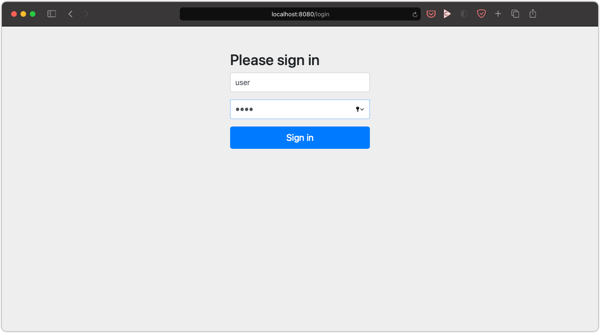
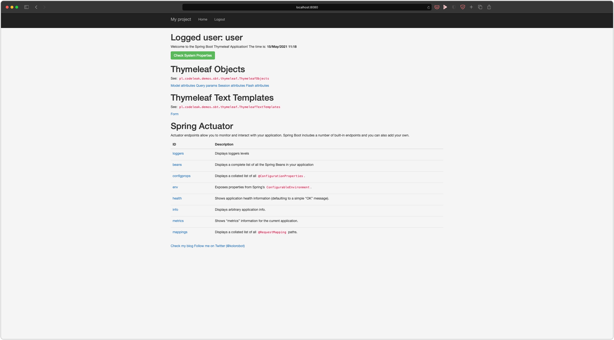

Spring Boot 2 and Thymeleaf with Maven
======================================

- Spring Boot 2
- Web application (WAR) packaging as well as self-contained JAR
- `Thymeleaf` with following dialects: Java 8 Time, Layout and Security
- `WebJars`

Prerequisites
-------------

- `JDK 11` and `JAVA_HOME` environment variable set 

Building the project
--------------------

Clone the repository:

    git clone https://github.com/kolorobot/spring-boot-thymeleaf

Navigate to the newly created folder:

    cd spring-boot-thymeleaf

Run the project with:

    ./mvnw clean spring-boot:run

Navigate to:

    http://localhost:8080

Login with: `user` and `demo`

Package the application
-----------------------

To package the project run:

    ./mvnw clean package

Screenshots
-----------

- Login

- Dashboard
  

On my blog:
-----------

Articles on my blog referencing to this project:

- [Java 8 Date & Time with Thymeleaf](http://blog.codeleak.pl/2015/11/how-to-java-8-date-time-with-thymeleaf.html)
- [Spring Boot and Thymeleaf with Maven](http://blog.codeleak.pl/2014/04/how-to-spring-boot-and-thymeleaf-with-maven.html)
- [Spring Boot Integration Testing with Selenium](http://blog.codeleak.pl/2015/03/spring-boot-integration-testing-with.html)
- [Spring Boot and Thymeleaf: Reload templates and static resources without restarting the application](http://blog.codeleak.pl/2016/12/thymeleaf-reload-templates-and-static-resources.html)
- [Getting started with Thymeleaf Text Templates](http://blog.codeleak.pl/2017/03/getting-started-with-thymeleaf-3-text.html)
- [Spring Boot and Security Events with Actuator](http://blog.codeleak.pl/2017/03/spring-boot-and-security-events-with-actuator.html)